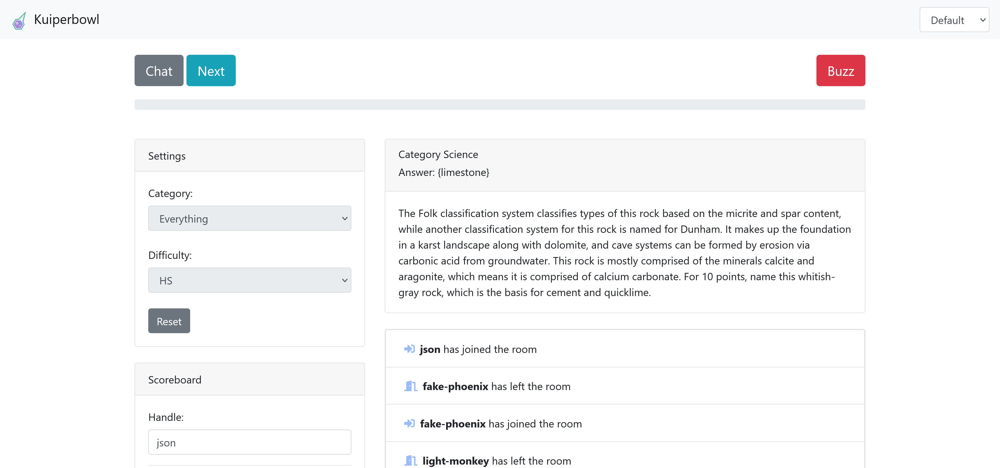

# Kuiperbowl

Real-time multiplayer quizbowl



## Local Development

### Setting up PostgreSQL
Install PostgreSQL. One quick and dirty way to install postgres is with:
```
conda install anaconda::postgresql
```

Ensure you initialize the desired file system location of the database cluster with the -D option. By default `/usr/local/pgsql/data`, but you might run into issues using WSL if you don't use a home subdirectory, but you might run into issues using WSL if you don't use a home subdirectory.
```
mkdir datadir
pg_ctl -D datadir initdb
pg_ctl -D datadir -l logfile start
```

Create a user called `postgres` and a database called `kuiperbowl`.
```
createuser -s postgres
createdb -U postgres -h localhost -p 5432 kuiperbowl
```

Configure `web/.env.local` from `.env` with proper credentials.

### Run the application
Set up a virtual environment if desired and run:

```
cd web

pip install -r "requirements.txt"
python manage.py migrate
python manage.py loaddata fixtures/default_rooms.json
python manage.py loaddata fixtures/sample.json

# Start redist cache for channel layer
# https://channels.readthedocs.io/en/stable/tutorial/part_2.html#enable-a-channel-layer
docker run -p 6379:6379 -d redis:5

python manage.py runserver --insecure
```

## Entering Tossup Data

Tossup questions can be loaded easily from a fixture. Data can be downloaded
from the [Protobowl DB dumps repo](https://github.com/neotenic/database-dumps)
or custom made. See `fixtures/sample.json` for an example custom fixture.

```
# Load fixture data from PB db dump
cd web
python scripts/pb_load.py
python manage.py loaddata fixtures/pbdump.json
```

## Using Docker

### Set Up and Run

Configure `.env` with proper credentials.

Start application:

```
docker-compose up --build
```

### Loading Data

```
# Get container name of kuiperbowl_web
docker ps

docker exec -it <CONTAINER ID> bash
python /usr/src/app/manage.py loaddata <FIXTURE PATH>
```
