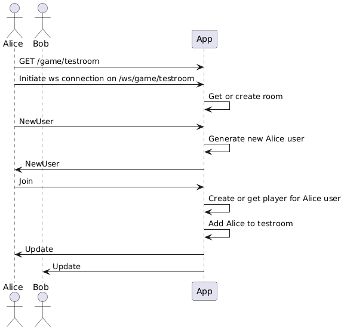
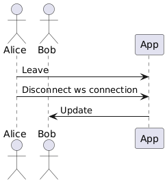
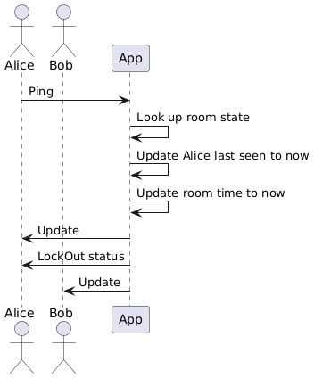
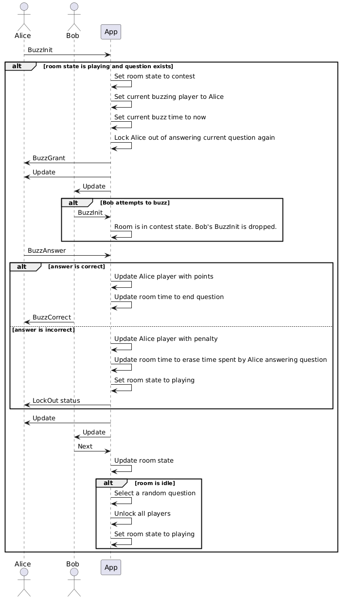
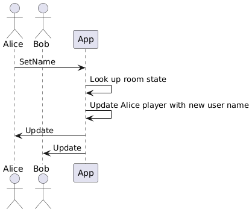

# Design

## Overview

Kuiperbowl is a real-time multiplayer quizbowl application. It allows users to play quizbowl-style trivia questions with each other on the web.

## Architecture


### Join



### Leave



### Ping



### Buzz and answer



### Change name



## Wire protocol

Client-server communication is done via websocket protocol. Websocket messages are JSON objects.

Messages are separated between client requests and server responses.

Request messages are constructed like the following:

```
{
  "request_type": string    // Request type denoting what content represents
  "user_id": string         // User id used to identify client's user
  "content": string         // Value being passed for request
}
```

Response messages are constructed like the following:

```
{
  "reponse_type": string      // Response type denoting which other fields are present
  ...                         // Other fields
}
```

### Requests

#### NewUser

Creates a new user and joins the room. User can choose to supply their own user id or let the server create one for them. User id is a secret value used to identify the requesting client in any further requests to the room. On success, server responds to the client ONLY with NewUser response.

```
{
  "request_type": "new_user"
  "user_id": string
}
```

#### Join

Joins a room.

```
{
  "request_type": "join"
  "user_id": string
}
```

#### Leave

Leaves a room.

```
{
  "request_type": "leave"
  "user_id": string
}
```

#### Ping

Pings for latest room state. On success, server will broadcast Update response to all users in the room.

```
{
  "request_type": "ping"
  "user_id": string
}
```

#### GetAnswer

Gets the answer of the latest question in the room. Answer is only sent if room is in an idle state.

```
{
  "request_type": "get_answer"
  "user_id": string
}
```

#### SetName

Sets the user's name. Content will be the user's new name.

```
{
  "request_type": "set_name"
  "user_id": string
  "content": string
}
```

#### BuzzInit

Initiates a buzz. If no other user is currently contesting the question, this claims the current question for the requesting user and prevents other users from trying to claim it for a short period of time.

```
{
  "request_type": "buzz_init"
  "user_id": string
}
```

#### BuzzAnswer

Answers a buzz. Content will be the user's answer to the question. This request is only processed if the requesting user is also the one who is currently claiming a contested question.

```
{
  "request_type": "get_answer"
  "user_id": string
  "content": string
}
```

#### SetCategory

Sets the room's category. Content will be the category value.

```
{
  "request_type": "set_category"
  "user_id": string
  "content": string
}
```

#### SetDifficulty

Sets the room's difficulty. Content will be the difficulty value.

```
{
  "request_type": "set_difficulty"
  "user_id": string
  "content": string
}
```

#### ResetScore

Reset's the user's score in the room to 0.

```
{
  "request_type": "reset_score"
  "user_id": string
}
```

#### Chat

Appends a message to the chat log. Content will be the message to send.

```
{
  "request_type": "chat"
  "user_id": string
  "content": string
}
```

#### ReportMessage

Reports a player via a message. Content will be the message id to report. If enough users report a user, that user will be banned.

```
{
  "request_type": "report_message"
  "content": string
}
```

### Responses

#### NewUser

Response indicating a new user has been created. This is sent ONLY to the client that requested the new user.

```
{
  "response_type": "new_user"
  "user_id": string
  "user_name": string
}
```

#### Update

Response with latest state of the room.

```
{
  "response_type": "update"
  "game_state": string
  "current_time": double
  "start_time": double
  "end_time": double
  "buzz_start_time": double
  "current_question_content": string
  "category": double
  "room_category": double
  "messages": {
    "message_id": string
    "tag": string
    "user_name": string
    "content": string | null
  }[]
  "difficulty": double
  "players": {
    "user_name": string
    "player_id": string
    "score": integer
    "correct": integer
    "negs": integer
    "last_seen": double
    "active": boolean
  }[],
  "change_locked": boolean
}
```

#### SendAnswer

Response with answer to latest question in the room.

```
{
  "response_type": "send_answer"
  "answer": string
}
```

### LockOut

Response indicating whether the user is locked out of the current question.

```
{
  "response_type": "lock_out"
  "locked_out": boolean
}
```

### BuzzGrant

Response indicating that the user has claimed the room's current question.

```
{
  "response_type": "buzz_grant"
}
```

#### Kick

Response indicating that the user has been banned from the room.

```
{
  "response_type": "kick"
}
```